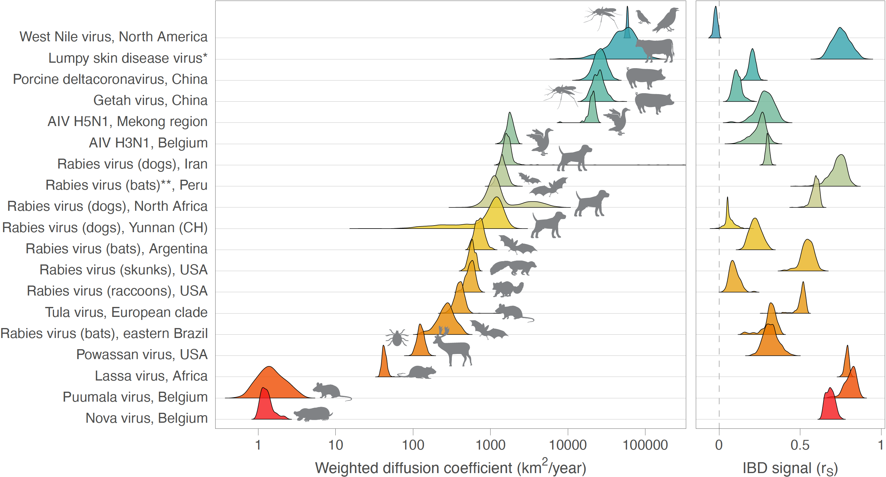

How fast are viruses spreading in the wild?
===============

This repo gathers the input files and scripts related to our study entitled "How fast are viruses spreading in the wild? An evaluation of phylogeographic metrics to quantify viral dispersal capacity in animal populations" (now on [biorXiv](https://www.biorxiv.org/content/10.1101/2024.04.10.588821v1)). R scripts related to the analyses based on simulated and real datasets are all available in `All_R_scripts.r`. Continuous phylogeographic simulations and dispersal statistics were respectively conducted and computed using the R package "[seraphim](https://github.com/sdellicour/seraphim)" (see also the “seraphim” [tutorial](https://github.com/sdellicour/seraphim/blob/master/tutorials/Estimating_dispersal_statistics.pdf) on the estimation of dispersal statistics). While the relaxed random walk (RRW) simulations along phylogenetic trees have been conducted with the function `simulatorRRW1` implemented in the R package “seraphim”, the script used to conduct the Brownian (BRW) and RRW simulations on an underlying georeferenced grid (raster) was implemented in a new function named `simulatorRRW2` now also available in “seraphim”.

Genomic data collected from viral outbreaks can be exploited to reconstruct the dispersal history of viral lineages in a two-dimensional space using continuous phylogeographic inference. These spatially explicit reconstructions can subsequently be used to estimate dispersal metrics that can inform on the dispersal dynamics and the capacity to spread among hosts. Heterogeneous sampling intensity of genomic sequences can however impact the accuracy of dispersal metrics gained through phylogeographic inference. In our study, we use simulations to evaluate the robustness of three dispersal metrics — a lineage dispersal velocity, a diffusion coefficient, and an isolation-by-distance signal metric — to the sampling effort. Our results reveal that both the diffusion coefficient and isolation-by-distance signal metrics appear to be robust to the number of samples considered for the phylogeographic reconstruction. We then use these two dispersal metrics to compare the dispersal pattern and capacity of various viruses spreading in animal populations. Our comparative analysis reveals a broad range of isolation-by-distance patterns and diffusion coefficients mostly reflecting the dispersal capacity of the main infected host species but also, in some cases, the likely signature of rapid and/or long-distance dispersal events driven by human-mediated movements through animal trade. Overall, our study provides key recommendations for the lineage dispersal metrics to consider in future studies and illustrates their application to compare the spread of viruses in various settings.

*__If you would like to compare the dispersal capacity and pattern associated with a continuous phytogeographic reconstruction that you conducted for a virus spreading in animal population(s), feel free to contact us to extend this figure with the estimates based on your dataset. The resulting figure and/or associated comparison will then be available for your study.__*
 
 

**Figure: comparison of dispersal metrics estimated for different genomic datasets of viruses spreading in animal populations.** Specifically, we here report posterior estimates obtained for two metrics estimated from trees sampled from the posterior distribution of a Bayesian continuous phylogeographic inference: the weighted diffusion coefficient and the isolation-by-distance (IBD) signal estimated by the Pearson correlation coefficient (rP) between the patristic and log-transformed great-circle geographic distances computed for each pair of virus samples. For both metrics, we report the posterior distribution of both metrics estimated through continuous phylogeographic inference for the following datasets: West Nile virus in North America [[1](https://www.nature.com/articles/s41467-020-19122-z)], Lumpy skin disease virus [[2](https://journals.asm.org/doi/10.1128/jvi.01394-23)], Porcine deltacoronavirus in China [[3](https://academic.oup.com/mbe/article/37/9/2641/5837118)], Getah virus in China [[4](https://journals.asm.org/doi/10.1128/jvi.01091-22)], avian influenza virus (AIV) H5N1 in the Mekong region [[5](https://academic.oup.com/bioinformatics/article/36/7/2098/5650406)] and H3N1 in Belgium [[6](https://wwwnc.cdc.gov/eid/article/29/2/22-0765_article)], rabies virus (dogs) in Iran [[7](https://onlinelibrary.wiley.com/doi/full/10.1111/mec.15222)], rabies virus (bats) in Peru [[8](https://www.pnas.org/doi/full/10.1073/pnas.1606587113)], rabies virus (dogs) in northern Africa [[9](https://journals.plos.org/plospathogens/article?id=10.1371/journal.ppat.1001166)] and in the Yunnan Province in China [[10](https://journals.plos.org/plospathogens/article?id=10.1371/journal.ppat.1007392)], rabies virus (bats) in Argentina [[11](https://onlinelibrary.wiley.com/doi/10.1111/mec.12728)], rabies virus (skunks) in the USA [[12](https://journals.plos.org/plosone/article?id=10.1371/journal.pone.0082348)], rabies virus (raccoons) in the USA [[13](https://www.pnas.org/doi/10.1073/pnas.0700741104)], Tula virus in central Europe [[14](https://academic.oup.com/ve/article/8/2/veac112/6956283?login=true)], rabies virus (bats) in eastern Brazil [[15](https://link.springer.com/article/10.1007/s11262-012-0866-y)], Powassan virus in the USA [[16](https://www.pnas.org/doi/full/10.1073/pnas.2218012120)], Lassa virus in Africa [[17](https://www.nature.com/articles/s41467-022-33112-3)], Puumala virus in Belgium [[18](https://academic.oup.com/ve/article/5/1/vez009/5476201)], and Nova virus in Belgium [[19](https://onlinelibrary.wiley.com/doi/10.1111/mec.13887)]. (\*) Estimates based on the analysis of the wild-type strains; (**) estimates based on the combined analysis of lineages L1 and L3  (see our study for further detail).
